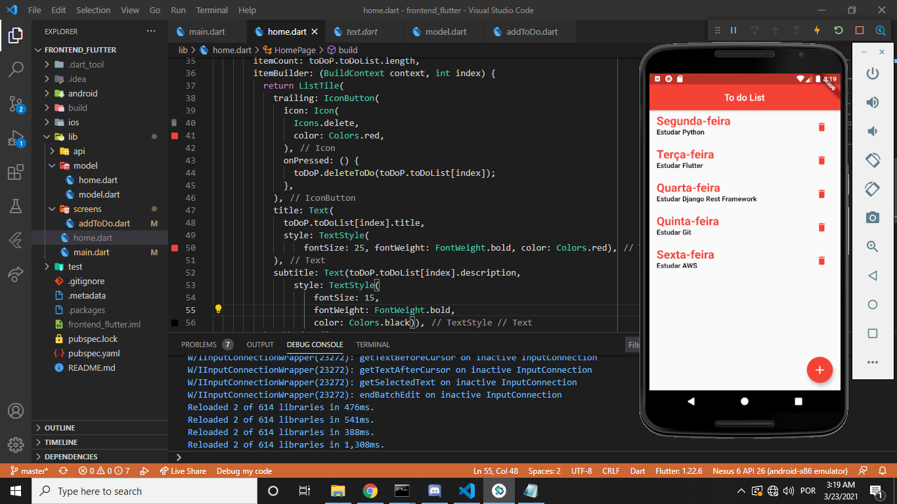

# Django_Flutter_ToDoList

# Django

My first project write in python

First Step:

    pip3 install -r requirements.txt
        
Second Step:

    rename the .env.sample file to .env and run:

Third Step:

    python manage.py migrate

Fourth Step:

    python3 manage.py createsuperuser
  
    
Finally

    run a command python3 manage.py runserver
    
    
# Flutter

First Step:

    flutter packages get
        
Second Step:

    flutter run

## Have fun =)

    

